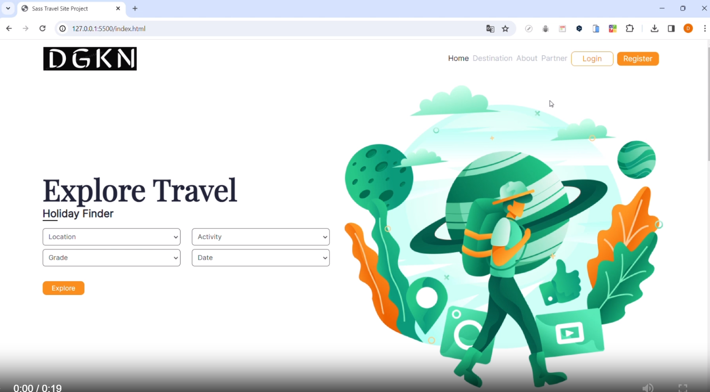

# Description
The project aims to create a travel website with Saas application.

## Objective
At the end of the project, following topics are to be covered;
* HTML
* CSS / SCSS / SASS
* JS
* Media Query

-----
### Project Skeleton:

```
    Parallax_Website (folder)
    |---- assets
            |----css (folder)   
                |----style.css  
                |----style.css.map
            |----img
                |---- *.png
                |---- *.jpg
            |----scss (folder)   
                |----abstracts (folder) 
                        |----_mixin.scss 
                        |----_variables.scss 
                |----base (folder) 
                        |----_reset.scss               
                |----components (folder) 
                        |----_footer.scss 
                        |----_navbar.scss 
                        |----_responsive.scss 
                |----sections (folder) 
                        |----_about.scss 
                        |----_destination.scss 
                        |----_home.scss 
                        |----_guide.scss 
                |----main.scss  
    |---- js
            |---- app.js
    |---- index.html
    |---- Readme.md

```

### Project View:




> Designed By DOGUKAN © Nov 2023